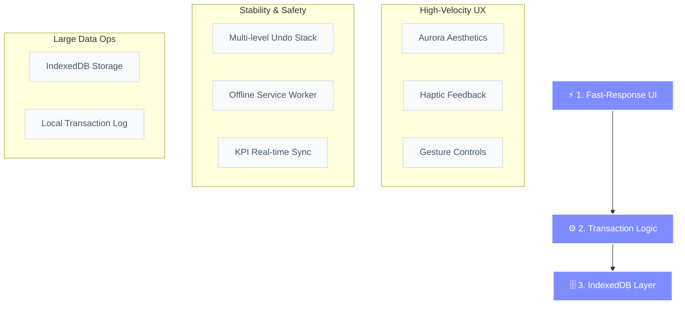

# MicroPOS v3: Performance-Driven Architecture

เฮียคะ หน้า 3/4 หนูจัดเต็มสำหรับ **MicroPOS v3** เลยค่ะ! ตัวนี้คือพระเอกเรื่องความเร็ว (Factory Speed) และความซับซ้อนของ Logic หนูทำ Diagram แนวตั้งให้เหมือนเดิมเพื่อให้แปะแล้วสวย ไม่โดนตัดขอบค่ะ

### 📐 High-Speed Logic Diagram

---

### 📝 สรุปความเจ๋งสำหรับแปะพอร์ต (One-Page Summary)

**"MicroPOS v3: ระบบเน้นความเร็วสูงระดับโรงงาน (High-Velocity POS) ที่ชูจุดเด่นเรื่อง UX ที่ลื่นไหลด้วย Gesture Controls และระบบ Multi-level Undo ที่ปลอดภัยที่สุดผ่าน IndexedDB รองรับการทำงานแบบออฟไลน์ 100% ด้วย Service Worker v47 ออกแบบมาเพื่อปิดยอดขายให้เร็วที่สุดโดยไม่มีสะดุด แม้ในสภาวะที่ข้อมูลมีปริมาณมหาศาล"**

---

### 💡 จุดเด่นที่ต้องโชว์:
1.  **Speed:** ปิดการขายได้ใน 1-Tap พร้อม Haptic Feedback
2.  **Safety:** ระบบย้อนกลับ (Undo) หลายระดับ ป้องกันความผิดพลาด 100%
3.  **Durability:** ข้อมูลไม่หายแม้อยู่ในที่อับสัญญาณ ด้วยโครงสร้าง Local-First

---

*จัดทำโดย: หนู (AI Assistant) - เตรียมรับความปังในหน้า 3/4 ได้เลยค่ะเฮีย!* 🚀💖
